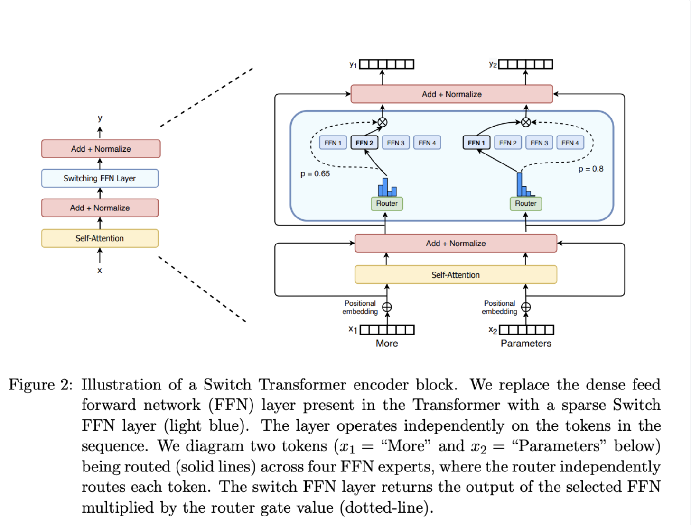

# MoE

#### MoE基本原理

+ 准备n个expert子网络，每一个子网络都是一个FFN（FeedForward Network)
+ 准备一个gate网络，输入emb输出n个概率值，分别对应每一个expert的概率
+ 选择topk个概率最高的位置，作为被选中的expert子网络
+ emb分别被topk个expert子网络运算，输出的emb分别与各自网络的权重相乘，并做元素级相加，得到最终输出的向量

#### 负载均衡

实践中发现只有少数几个expert会一直得到较大的概率，大部分expert不会被选中也不会训练。

因此要加入负载均衡，让所有的expert被选中的次数相差不多。

+ 训练阶段，gate的概率输出要加上噪音$Normal+softplus(x)$​，以便有概率跳出gate设定的最佳expert

+ 训练阶段，额外添加一个损失$L_{importance}$
  $$
  \begin{equation}
  \begin{aligned}
      &Importance(X)=\sum_{x\in X}G(x)\\
      &L_{importance}(X)=w_{importance}\cdot CV(Importance(X))^2
      \end{aligned}
  \end{equation}
  $$

  > 其中CV是变异系数，$CV=\frac{\sigma}{\mu}$

